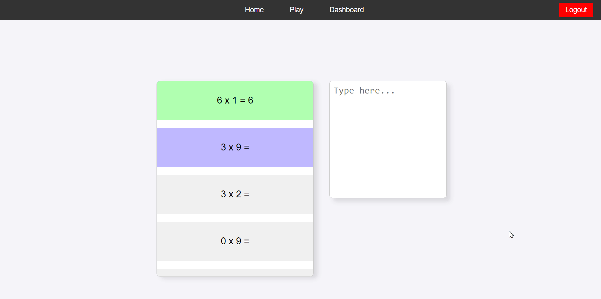
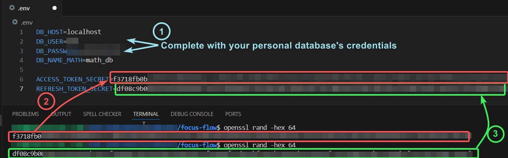
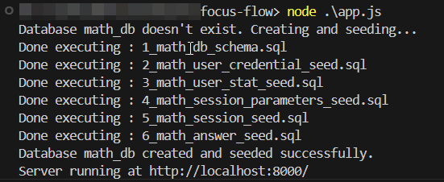
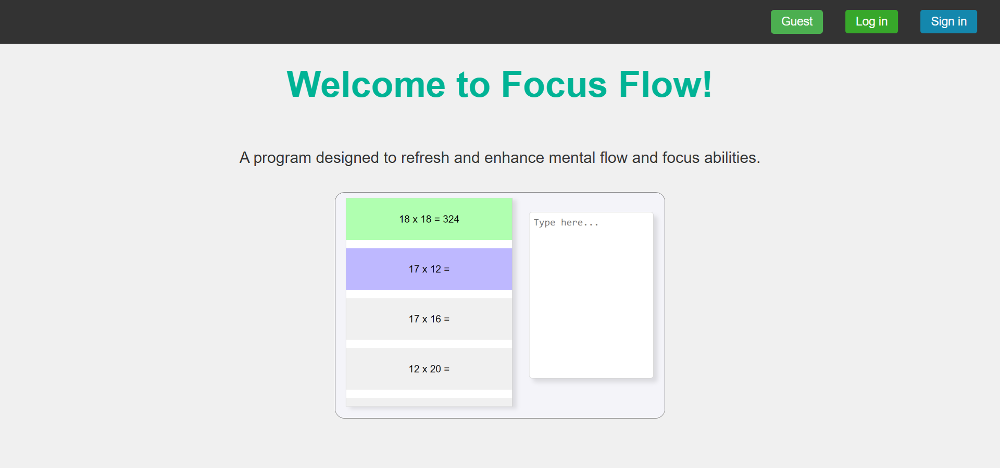
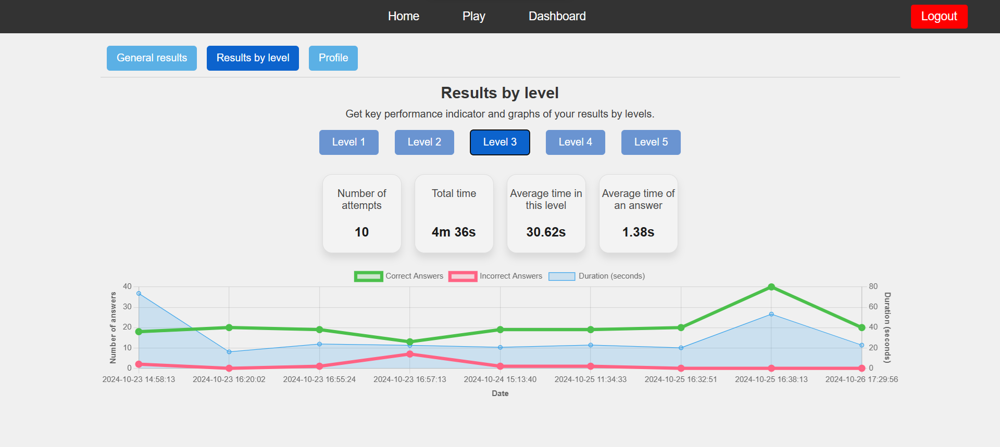

# Table of Contents
1. [Introduction](#introduction)
2. [Demo](#demo)
3. [Features](#features)
4. [Installation](#installation)
    - [Prerequisites](#prerequisites)
    - [Clone the Repository](#clone-the-repository)
    - [Install Node Dependencies](#install-node-dependencies)
    - [Environment Variables](#prepare-your-environment-variables)
        - [What is a .env File?](#what-is-a-dotenv-file)
        - [Creating your .env File](#creating-your-dotenv-file)
    - [Database Setup](#database-setup)
    - [Run the App](#run-the-app)
5. [Screenshots](#screenshots)
    - [Dashboard Page](#dashboard-page)
    - [End Results](#end-results)

# Introduction

Welcome to **Focus Flow**, an application to test your math skills!
This app provides users with a customizable set of math questions at various difficulty levels and offers an interactive dashboard to track performance.  
Use the guest mode to explore sample data or sign up to save your personalized stats.  
You may try this app hosted on a personal server using the following link : https://focus.highigh.live/preview


## Demo



## Features
- **Flexible Math Challenges**: Choose from multiple difficulty levels or create a custom set of questions.
- **Dashboard Insights**: Track performance metrics, including time, date, and scores across levels.
- **User Authentication**: Securely log in using JSON Web Tokens (JWT) to save your progress.
- **Guest Access**: Try the app without registering via a "Guest" option to explore the features with sample data.

## Installation
If you wish to install the app on your own, you can follow this section. 
### Prerequisites
Ensure you have the following installed:
```
Node.js (v20)
MySQL
git
OpenSSL
```

### Clone the Repository

```bash
git clone https://github.com/Goubigon/focus-flow.git
```

### Install node dependencies
Navigate into the project folder and install dependencies:
```bash
cd focus-flow
npm install
```

The last command should have installed the following key packages:
```bash
npm list
```
```

The last command should have installed the following key packages.
```bash
├── bcrypt@5.1.1
├── cookie-parser@1.4.7
├── dotenv@16.4.5
├── express@4.21.1
├── jsonwebtoken@9.0.2
└── mysql2@3.11.4
```

### Prepare your environment variables

#### What is a dotenv file?
A .env file stores environment variables securely, including sensitive information like database credentials and API keys. It simplifies configuration management and enables easy environment switching (e.g., development, testing, production).

To prevent sensitive data from being pushed to version control, the .env file is ignored by .gitignore.  

**The app needs you to create your own .env file and complete it with the correct information.**

#### Creating your dotenv file
Copy .env.example to .env
```bash
cp .env.example .env
```
Generate a cryptographic string for ACCESS_TOKEN_SECRET using OpenSSL:
```bash
openssl rand -hex 64
```
Then generate another one for REFRESH_TOKEN_SECRET:
```bash
node -e "console.log(require('crypto').randomBytes(64).toString('hex'));"
```

In your newly created .env file:
1. Replace DB_USER and DB_PASSWORD with your actual credentials.
2. Replace the ACCESS_TOKEN_SECRET with a generated cryptographic string.
3. Replace the REFRESH_TOKEN_SECRET with a different generated cryptographic string.
```
DB_HOST=localhost
DB_USER=your_username # Your MySQL username
DB_PASSWORD=your_password # Your MySQL password
DB_NAME_MATH=math_db

ACCESS_TOKEN_SECRET=your_access_token_secret # Secret for signing access tokens
REFRESH_TOKEN_SECRET=your_refresh_token_secret # Secret for signing refresh tokens
```




### Run the App

Start the server:
```bash
node ./app.js
```
The app checks if the databases exist and have the correct data; creating and filling them if needed.


You should see :


And you will be able to access the page by following that link.

# Screenshots

## Preview page
The first preview page you will see when accessing the app


## Dashboard page
A dashboard summarizing all the data

